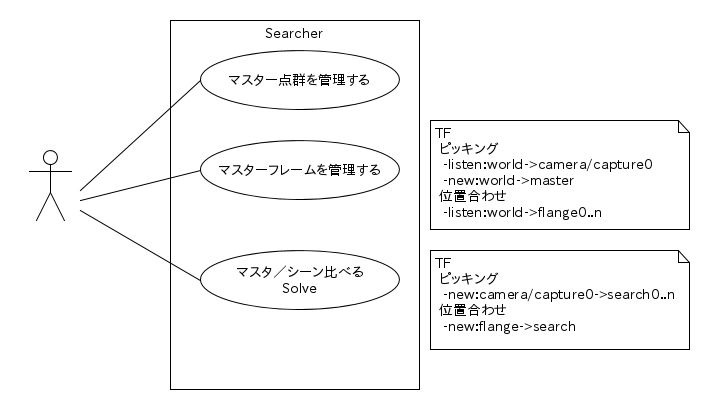

## Searcher

### 要件
- 入力(モデルおよびシーン)点群を解析し、モデルとシーン間の座標変換を求める
- 求めた座標変換をTFに送る
- 解析には様々なアルゴリズム(Open3D,Halcon)が使えるように、アルゴリズム部を外部モジュール化する

### UML

## 準備
### Open3D
~~~
pip install open3d-python --user
~~~
OPen3D-0.6からPipのバージョンが9.0.1以上が必要となりました。これより古いときは
~~~
pip install pip==9.0.3
~~~

## Parameter
### ~config

|name|type|description|
|:----|:----|:----|
|path|string|レシピフォルダ(recipe/)が存在するパスを与える|
|scenes|string[]|多重化されたシーン系列の各系列の名称。~in/*/floatsトピックの*に展開される。|
|master_frame_id|string[]|~saveにてファイル保存するフレーム名。Transform情報はその時のscene_frame_idの対応するフレームを参照する。また~loadではファイル保存されたフレームをTFに再現する。|
|scene_frame_id|string[]|~saveにて保存対象とするフレーム名|
|solve_frame_id|string|解析を行うフレーム名。解析処理後このフレームに"/solve0..n"を付加したフレームを追加する。|

### ~param  
|name|type|description|
|:----|:----|:----|
|scene_frame_id|string[]|~saveにてファイル保存するフレーム名。Transform情報はその時のscene_frame_idの対応するフレームを参照する。また~loadではファイル保存されたフレームをTFに再現する。|
|scene_frame_id|string[]|~saveにて保存対象とするフレーム名|
|solve_frame_id|string|解析を行うフレーム名|

## Topics
### To subscribe

|Topic|タイプ|説明|
|:----|:----|:----|
|~in/*/floats|Floats|シーン点群。*はscenesパラメータで与えた点群の系列名|
|~clear|Bool|シーンをクリアする|
|~solve|Bool|シーンを解析し、マスターに一致する物体を見つける。見つかった場合は、solve_frame_idで与えたフレームに"/solve0..n"を付加したフレームを追加する。|
|~load|Bool|recipe/からマスターデータをロードする|
|~save|Bool|現在のシーンをマスターとする。同時にrecipe/に保存する。|

### To publish

|Topic|タイプ|説明|
|:----|:----|:----|
|~master/*/floats|Floats|モデル点群。モデルをロードしたとき、およびシーンをsubscribeしたとき初期位置の点群をpublishする|
|~cleared|Bool|~clear終了でアサートされる|
|~solved|Bool|~solve終了でアサートされる|

## Test
~~~
roslaunch rovi_utils searcher.launch
~~~
の後
~~~
rostopic pub -1 /request/capture std_msgs/Bool True
~~~
にて∞テストを開始します。マスターデータはrecipe/以下、シーンデータは../data/sample.plyを用いています。  
solver_test.pyにて誤認識を検出する予定(アルゴリズム検討中)。

----
## Solver標準化  
SearcherはSolverを外部モジュール化し、様々なアルゴリズムのSolverを組み込むように設計されています。Searcherに組み込み可能なSolverは以下の設計標準に適合していなければなりません。
### インタフェース  
Solverモジュールは以下のメソッド(モジュール内では関数)が必須です。
1. learn(master_data:list of Numpy array,param:dictionary)
2. result:dictionary = solve(scene_data:list of Numpy array,param:dictionary)  
 - resultには"transform"キーと、その値としてTransformの配列が必須です
 - resultには"transform"以外の任意のキーを含むことが出来ます。これはマッチングのスコアとしてscoreトピックにpublishされます。データ形式はfloatの配列に限ります。

### テスト  
ソルバーのテストは、ローカルのテストデータなどを使って、単体テストが実行できるように実装しなければなりません。本Respositryの*o3d_solver.py*を参考にしてください。
~~~
./o3d_solver.py
~~~
